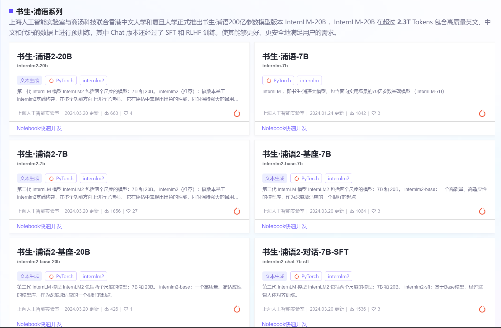
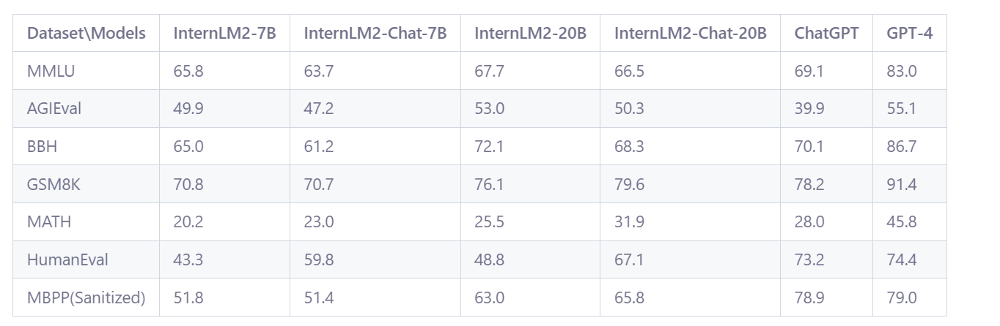

本文详细阐述了大型语言模型（LLM）在长文本预训练数据方面的整体准备工作。其中，对“书生·浦语”这一大规模语言模型的全面开源生态系统进行了深入概述。主要内容包括该模型的背景介绍、所采用的数据来源、训练过程的技术细节、模型的调优方法、部署策略、性能评估标准以及实际应用场景。

上海人工智能实验室与商汤科技联合香港中文大学和复旦大学正式推出书生·浦语200亿参数模型版本 InternLM-20B ，InternLM-20B 在超过 2.3T Tokens 包含高质量英文、中文和代码的数据上进行预训练，其中 Chat 版本还经过了 SFT 和 RLHF 训练，使其能够更好、更安全地满足用户的需求。

InternLM2_Base：高质量、强可塑性的基座模型,适合做SFT微调。

InternLM2：在Base基础上，在多个能力进行了强化，更优秀的基座模型。

Chat-SFT：在Base基础上，经过有监督微调SFT后的对话模型，具有更好的人机交互能力。

InternLM2-Chat：在Chat-SFT基础上，再经过RLHF对齐后的对话模型，具有良好的价值观。

模型下载地址，最常用的有：

HuggingFace：https://link.zhihu.com/?target=https%3A//huggingface.co/internlm
ModelScope：https://link.zhihu.com/?target=https%3A//modelscope.cn/organization/Shanghai_AI_Laboratory

书生·浦语大模型全链路开源体系
一、大模型成为发展通用人工智能的重要途径
本世纪初 — 2022年：研究集中在专用模型上，针对特定的任务采用专用的模型解决问题
近两年：往通用大模型的方向发展，一个模型应对多种任务和多种模态
→通用大模型成为大家追逐的热点→通往通用人工智能的一个关键途径

书生·浦语大模型开源历程
InternLM 2 有了非常大的提升，能够解决更真实的问题和更复杂的场景。
面向不同的使用需求，每个模型包含 3 个模型版本。（Base，SFT，Chat）
7B   —— 轻量级模型
20B —— 重量级模型
所有模型均面向社区开源，用户可以根据自己的实际场景和需求进行选用。

回归语言建模的本质
InternLM 2 最主要的初心：回归语言建模的本质。
大模型的本质 —— 语言建模（根据给定的 context 预测接下来的 token）
→关键之处：拥有高质量的语料，让模型能够学会更好的建模能力

书生·浦语2.0（InternLM 2）的主要亮点
1. 具备超长的上下文能力
2. 综合性能全面提升（在重点评测上比肩ChatGPT）
3. 优秀的对话和创作体验（指令跟随能力和结构化创作能力）
4. 工具调用能力整体升级（构建复杂智能体）
5. 突出的数理能力和实用的数据分析功能（强化了内生计算能力，在不借助任何的外部工具或者计算器的情况下，拥有较准确的计算能力）
   性能全方位提升

书生可以被称为7B最强大模型。

